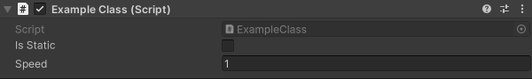

# DPG-Unity-Common

<!-- TOC -->

* [DPG-Unity-Common](#dpg-unity-common)
    * [Editor](#editor)
        * [Conditional Hide](#conditional-hide)
    * [Runtime](#runtime)
        * [Singletons](#singletons)
            * [`PersistentSingleton.cs`](#persistentsingletoncs)
            * [`Singleton.cs`](#singletoncs)

<!-- TOC -->

## Editor

### [Conditional Hide](https://github.com/AMRC-DPG/DPG-Unity-Common/tree/25bb80524ce5433f89fc4b57895624a504f93602/Editor/ConditionalHide)

An attribute that will show or hide a variable within the inspector based on another inspector exposed boolean.



<details><summary>Code example</summary>

```csharp
public class ExampleClass : MonoBehaviour
{
    [SerializeField] private bool isStatic;

#if UNITY_EDITOR
    [ConditionalHide(nameof(isStatic), false, true)]
#endif
    [SerializeField]
    [Min(1f)]
    private float speed = 1f;

    public float GetSpeed => isStatic ? 0f : speed;

    private void Update()
    {
        // Do something with GetSpeed
    }
}
```

</details>

## Runtime

### [Singletons](https://github.com/AMRC-DPG/DPG-Unity-Common/tree/67c0c7c390846d374a374738f69ef3b58b84ce54/Runtime/Singletons)

Abstract classes to provide singleton pattern logic for the derived class.

*Note - If using the `Awake()` function within the derived class. It must be overriden and call `base.Awake()` within the derived class' `Awake()`
function.*

#### `PersistentSingleton.cs`

Makes the object a singleton, and uses Unity's `DontDestroyOnLoad()` function to provide persistence between scenes.

#### `Singleton.cs`

Only makes the object a singleton, and it will be destroyed on load by default.

<details><summary>Code example</summary>

```csharp
public class ExamplePersistentSingletonClass : PersistentSingleton<ExamplePersistentSingletonClass>
{
    protected override void Awake()
    {
        // Custom code here
        
        base.Awake();
    }

    private void Start()
    {
        throw new NotImplementedException();
    }

    private void Update()
    {
        throw new NotImplementedException();
    }
}

public class ExampleSingletonClass : Singleton<ExampleSingletonClass>
{
    protected override void Awake()
    {
        // Custom code
        
        base.Awake();
    }

    private void Start()
    {
        throw new NotImplementedException();
    }

    private void Update()
    {
        throw new NotImplementedException();
    }
}
```

</details>
