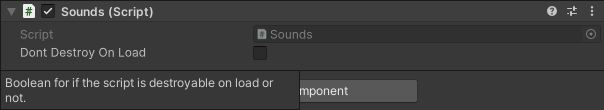

# DPG-Unity-Common

<!-- TOC -->
* [DPG-Unity-Common](#dpg-unity-common)
  * [Editor](#editor)
    * [ConditionalHide](#conditionalhide)
  * [Runtime](#runtime)
    * [Singletons](#singletons)
<!-- TOC -->

## Editor

### [Conditional Hide](https://github.com/AMRC-DPG/DPG-Unity-Common/tree/25bb80524ce5433f89fc4b57895624a504f93602/Editor/ConditionalHide)

An attribute that will show or hide a variable within the inspector based on another inspector exposed boolean.


<details><summary>Code example</summary>

```csharp
public class ExampleClass : MonoBehaviour
{
    [SerializeField] private bool isStatic;

#if UNITY_EDITOR
    [ConditionalHide(nameof(isStatic), false, true)]
#endif
    [SerializeField]
    [Min(1f)]
    private float speed = 1f;

    public float GetSpeed => isStatic ? 0f : speed;

    private void Update()
    {
        // Do something with GetSpeed
    }
}
```

</details>

## Runtime

### [Singletons](https://github.com/AMRC-DPG/DPG-Unity-Common/tree/67c0c7c390846d374a374738f69ef3b58b84ce54/Runtime/Singletons)

An abstract base class to provide the logic for the Singleton Pattern to the subclass component.

<details><summary>Code example</summary>

```csharp
public class Sounds : Singleton<Sounds>
{
    protected override void Awake()
    {
        // Custom code
        
        base.Awake();
    }

    private void Start()
    {
        throw new NotImplementedException();
    }

    private void Update()
    {
        throw new NotImplementedException();
    }
}
```

</details>

It also provides functionality to choose (from the inspector) whether the subclass is destroyed on load or not.


